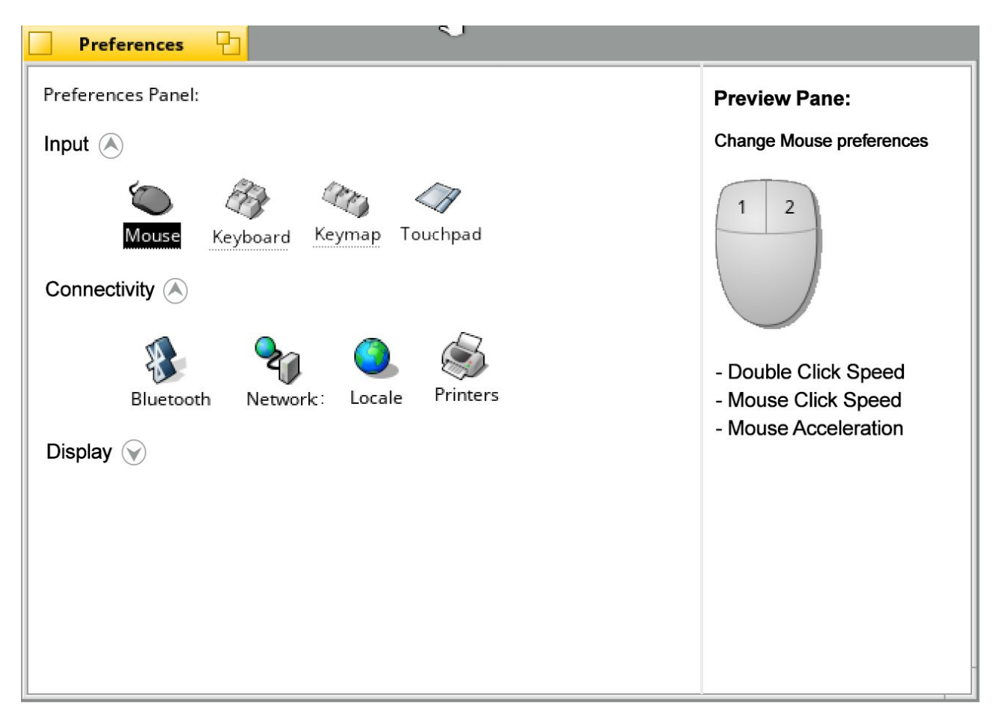
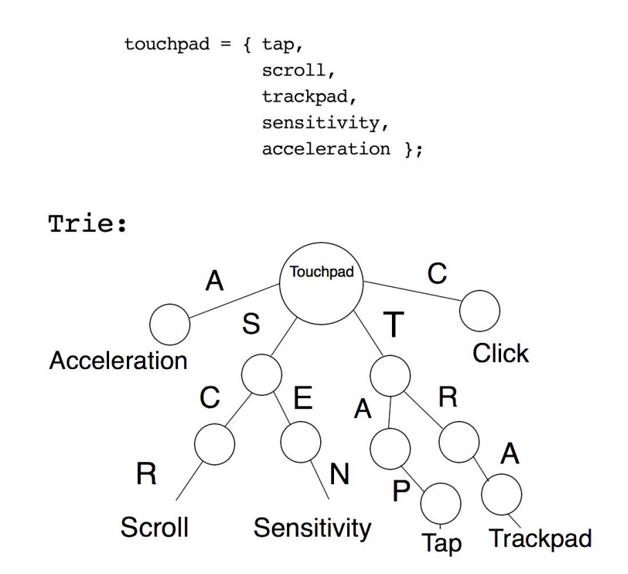
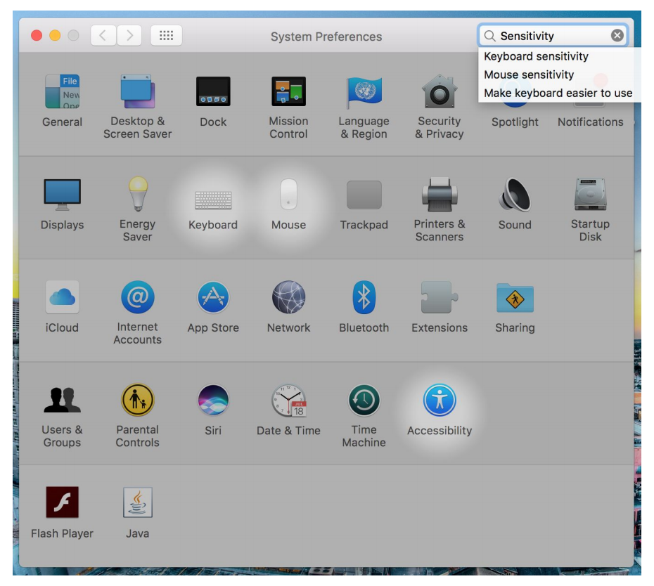

+++
type = "blog"
title = "[GSoC 2017] Preferences GUI Refactoring Intro"
author = "anirudhm"
date = "2017-05-06 23:32:54+00:00"
tags = ["haiku", "gsoc2017", "gsoc"]
+++

Hello World.

I'm **Anirudh Murali** (Trac: *anirudh*; IRC: *anirudhm*), from the southern region of India. I thank Haiku for selecting me as one of **Google Summer of Code 2017** student. I'll be working on the idea: "**Preferences GUI Refactoring**" this summer along with my mentors: *waddlesplash* and *Sean Healy*.

As of now, if one has to access any Preferences, a right click on the Deskbar, and accessing it with the submenu of Preferences, and still people who are new to Haiku end up selecting the wrong preferences option, atleast it happened for me. Even though Preference options are labelled, new users who aren't familiar with the terminology take time to find the right option. What I intend to do for this summer is to revamp the access method of Preferences.

### Preferences Panel

A Preference Panel containing shortcuts to every preference options, sorted under respective categories.
For example, Keyboard, Mouse, Trackpad preferences would be coming under Input section and similarily other options as well.

Here are snapshots from Windows' *Control Panel*, macOS' *System Preferences* and Ubuntu's *System Settings*. Haiku's **Preferences Panel** consisting of all preferences listing would make things simpler and easily accessible. One can still access the menu based Preferences listing and open the Preferences in the form of window which is present as of now.

Here's a mockup of what Haiku's Preferences Panel would look like (subject to change):

Nearby to every preference option, either in a side pane or nearby the option, a quick toggle of most used preference will be added. Example: Enabling/Disabling Trackpad with a checbox in the central panel.

#### Search Implementation with Trie

Along with this, a Search bar to filter the displayed Preference listing. Every preference listing will be assigned with set of meta keywords which will include the options present inside the preference listing, and a Trie with all the keywords pushed in the tree. Using this method for traversal will allow us to fetch results in O(m) timeframe where m is the length of the string entered by the user.

Upon user’s query through the Search bar, depending upon the characters he/she enters, the string must be compared with the trie entries of multiple preference panels and then the preference panels containing the option will be highlighted, similar implementation in macOS' System Preferences.

This is what I'll be building this summer, I have plans to work on **wildcard search feature**, something similar to **macOS's Spotlight search**, I'll work on these after GSoC is done. Let's see how things proceed.

**Citations:**

* https://github.com/michaelbull/c-dictionary-trie
* http://theoryofprogramming.com/2015/01/16/trie-tree-implementation/
