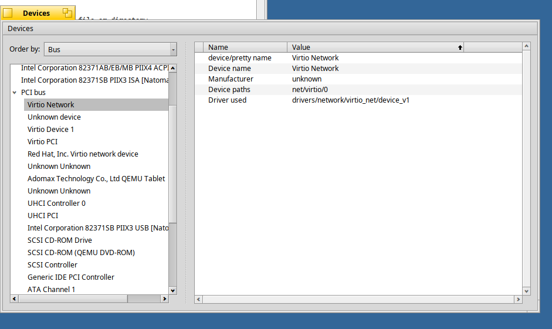
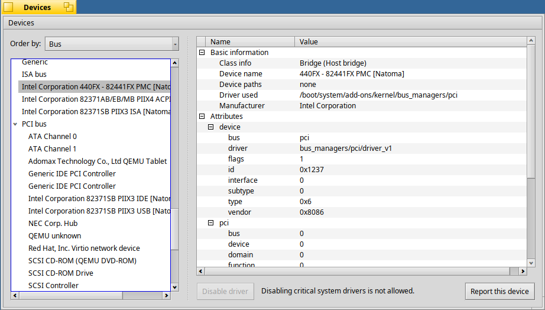

+++
type = "blog"
title = "[GSoC 2026] Expanding the functionality of the Haiku Devices Application - Final Report"
author = "aquamatic123"
date = "2026-08-21 11:52:01-04:00"
tags = ["haiku", "software", "gsoc", "gsoc2026"]
+++

Hello everyone! As Google Summer of Code 2026 comes to a close, it's time to summarize the work I've done over the summer on expanding the functionality of the Haiku Devices application.

## Overview
Haiku’s Devices application previously provided a basic list of connected hardware, but lacked the features necessary to function as a true management utility. My project aimed to transform Devices into a more capable hardware manager, allowing users to view detailed technical specifications and perform administrative tasks directly from the GUI. Over the course of the summer, I focused on implementing new visualization features, improving the user experience, and pulling more detailed hardware information directly from the system.

## Completed Objectives & Work Accomplished
Here is a breakdown of what was accomplished this summer:

* **Driver Mapping:** Integrated the GUI with the kernel structures to display the active driver module name and its absolute path (`/dev`). This involved extending the device_manager module by adding a new device attribute and being able to fill that attribute when possible. 
* **Extract USB descriptors:** Enhanced the application’s ability to inspect USB devices. By utilizing the `BUSBDevice` API, the app now builds a tree with all USB attributes descending the USB hierarchy. We first loop through the configurations, then the interfaces, and finally the endpoints. The app can also display HID descriptors. 
* **State Management (Packaged Driver Blocking):** Added a new GUI button to disable or re-enable packaged drivers. This required implementing the backend logic to read, modify, and write to the system's `Packages` configuration file. I also added safety checks to prevent users from accidentally disabling drivers essential to the system, and added warnings to guide the user through the process.
* **Unit Tests:** Although not explicitly part of my initial proposal, I took the initiative to write unit tests for the application. This was a fantastic learning experience for understanding how testing is handled within the Haiku codebase.
* **Improve User Experience:** Multiple commits were merged to implement better overall usability for the application, including:
  * **Alphabetical Sorting:** Devices are now sorted alphabetically for easier navigation.
  * **Attribute Separation:** Device details are cleanly separated into `Basic Information` and more advanced `Attributes`.
  * **Persistent Selection:** The application now remembers and reselects the active device even when the sort order is changed.
  * **State Saving:** Loading and saving application settings across sessions, such as the chosen sorting order and the GUI window size.

Here is what the Devices application looked like before:

And here is the application after adding the new features:

## The Code 
All of the code written during this GSoC period can be found on the Haiku Gerrit. 

Here is the link to all my patches:
[My Gerrit Commits](https://review.haiku-os.org/q/owner:leorouleau5070@gmail.com)

Here are the most notable patches from my project:
* [Devices: Add packaged driver blocking feature](https://review.haiku-os.org/c/haiku/+/11365) - *Implemented the backend logic and GUI button to safely disable and re-enable packaged drivers via the `Packages` settings file.*
* [Devices: Extract USB descriptors](https://review.haiku-os.org/c/haiku/+/11071) & [Fetch HID report descriptors](https://review.haiku-os.org/c/haiku/+/11166) - *Added deep inspection for USB devices, building a hierarchy of configurations, interfaces, endpoints, and displaying HID descriptors.*
* [Devices: extend dm_wrapper and new layout](https://review.haiku-os.org/c/haiku/+/11012) - *Integrated the GUI with the kernel structures to extract and display the active driver module name and path.*
* [Devices: Add hardware compatibility report](https://review.haiku-os.org/c/haiku/+/11543) *(Pending Review)* - *The groundwork for exporting the system's hardware tree into a standardized JSON report*

## Challenges and Learnings
I had to face a lot of challenges in this project. Some notable challenges were:

### Adapting to an Open Source Community
This was my first time contributing to open source software, so when I first approached Haiku OS, I had a tense feeling that I couldn't make a mistake in my patches. Fortunately, this feeling didn't last long, as I noticed the community is really open and much less scary than it might seem! People are always open to discussing changes, and everybody's opinion matters.

### New Codebase
This is a challenge that most, if not all, GSoC contributors face. It's self-explanatory, but a lot of time was spent scouting through the repository, figuring out what I needed and where it was located.

### Learning the Haiku API
Working with Haiku's unique C++ APIs was both a challenge and a fantastic learning experience. It took time to familiarize myself with how the UI components interact with system structures, but using components like `BUSBDevice` and `device_manager` taught me how Haiku's internals work and how everything is structured nicely.

### Applying Haiku's style guidelines
This wasn't much of a challenge, but more of a learning opportunity to understand how important guidelines are to a large project and how they improve readability. I had to work a bit with my text editor to apply those new guidelines, but it was absolutely worth it in the end.

### Technical difficulties
I obviously had multiple tasks that got me stuck for a while, requiring me to redo parts of my plan. Here are a few examples:

* **HID Parser:** I was able to fetch the HID if a device had one, but it was not parsed. I had issues implementing the parser and was really limited on time. I couldn't seem to get the parser to compile or actually use it in the app. I'm sure there's a solution for it, but I had to stop trying to fix it and move on to the next feature. I left it as a todo.
* **USB Stack:** I personally found the USB kit quite complicated. I had to spend a lot of time figuring out what headers I needed for my code to work, how the entire kit worked together, and which methods I could use.
* **Finding the Right Attribute/Flag:** Especially in the `device_manager`, some attributes just seemed to be similar, at least in name (for example, `B_DEVICE_ID` and `B_DEVICE_UNIQUE_ID`). Some testing had to be done to verify that the attributes I fetched were the right ones.

## Future Work & Unresolved Issues
While most of the project is complete, there are a few items and patches that I plan to wrap up in the future:

* **Bluetooth Support:** A patch was developed to display Bluetooth controllers and connected devices, but it is currently on hold. Two other GSoC students are revamping Haiku's Bluetooth stack this summer, so merging my changes now could lead to conflicts or obsolete code. This feature will be revisited once the new stack is finalized.
* **Compatibility Report:** The logic to export the system's hardware tree into a standardized JSON report was the final task of my GSoC period and is currently pending review. There are ongoing architectural discussions regarding the exact use-case and implementation of the report that need to be resolved before it is fully upstreamed.

## Acknowledgements
I would like to give a massive thank you to my mentors, KapiX and Korli, for their incredible patience, guidance, and helpful code reviews throughout the summer. Your support has greatly helped me grow as a developer and as an open source contributor.

I also want to thank the Haiku community for being so welcoming and always willing to discuss changes and share their expertise, especially in code reviews. Finally, thank you to Google for hosting the Summer of Code program and providing this opportunity to contribute to open source!

Thank you for reading, and I look forward to continuing to contribute to Haiku!
