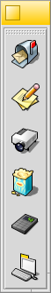

+++
type = "blog"
title = "Which Launcher?"
author = "moochris"
date = "2017-01-22 12:05:49+00:00"
tags = ["haiku", "software"]
+++

So you've installed Haiku from a recently nightly (or sometime soon, the R1 beta) and you're launching applications from the 'leaf' menu. Perfect, but there are a few more options to investigate if you want to quickly launch your favourite programs.

<!--more-->

The first option is the simplest. In the 'leaf' application menu, just click on the 'Applications' submenu (or any of the others) to open a tracker window with shortcuts. Right-click on a shortcut and in the context menu select 'Create link', then 'Desktop'. Hey presto, a shortcut icon on your desktop.

This does require you to double-click the icon and the desktop can end up a bit messy this way :) Second option - use LaunchBox.

LaunchBox can be found in 'Desktop applets' in the 'leaf' menu and you can make it start at boot by right-clicking on its icon and 'Create link' to /home/config/settings/boot/launch.

You can add buttons (or clear existing ones) using the context menu and simply drag and drop the program's icon to the empty button to create a launcher. It's quite customisable and you can also define multiple launch 'pads'.

Another option is LnLauncher, available in the repositories (through HaikuDepot or using pkgman on the command line). This is a very neat launcher, with some smart features. Initially, when you first run LnLauncher, a little yellow handle is stuck to the edge of the desktop. You can drag and drop program icons onto the handle to add them to the panel, reordering by dragging the icon within the panel whilst holding down the right mouse button. Similarly, you can move the panel by dragging it around the screen edge with the right mouse button. You can change the colour of the panel's handle by dragging your desired colour from a colour picker, such as 'Colors' (available in the repository), onto the handle.
