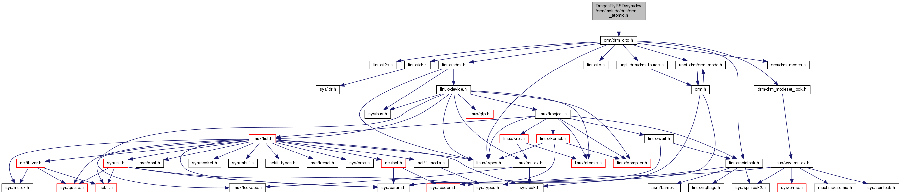
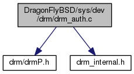

+++
type = "blog"
title = "[GSoC 2017] 3D Hardware Acceleration - Weekly Report 1"
author = "vivek"
date = "2017-05-19 00:49:04+05:30"
tags = ["driver", "gsoc2017", "gsoc"]
+++

### Hello again

My previous blog post was a brief introduction to my project - 3D Hardware Acceleration in Haiku. The second week of GSoC demands the second post and so here we go.

### Bonding

Well, there hasn't been a lot of coding work in the last two week, as much as I would have liked, primarily because I wasn't well for a couple of days. But, I did do what I am supposed to do at this period, i.e. "Bonding with the Community".

I was regular to the IRC before GSoC started, so I was already familiar with the names. Last two weeks I came to know the people even better. Adrien (*PulkoMandy*), Fredrik (*tqh*), James Taylor (*Duggan*) and Alex (*kallisti5*) have helped me a lot, among others. I also made friends with my fellow interns - Akshay (*akshay*), Anirudh (*anirudhm*), Ayush (*a-star*), Deepanshu (*digib0y*), Hy (*ugen*) and Joseph (*return0e*). Good luck to all of them.

### Progress

I started off, thinking of trying to generate an include dependency graph (every node in the graph represents a header/source file in the project and every directed edge from file1 to file2 indicates that file1 has included file2). The motivation was if I could generate such a graph, then I could easily move up from the leaf nodes to the highest-connectivity node in the graph, without breaking the compilability of the source.
I tried to generate the graph using Doxygen, running it on DragonflyBSD's sources.

It looked good for some files, like drm_atomic.h shown below.

But it failed for drm_auth.c (drmP.h has a fairly large list of dependencies, which I expected to see in the graph, but unfortunately did not).

I asked people on the mailing list for help, and surely enough, received a lot of it. PulkoMandy suggested some more tools, but none of the seemed to work the way I wanted them to. At last, on PulkoMandy's and Duggan's suggestions, I decided to add files to the source and rely on the compiler generated error files to proceed.

I have set up the development environment. The Jamfile for building DRM is ready and populated with the files required for DRM. The way I am moving forward from here is as follows:

1. Uncomment a file in the DRM Jamfile, so that an attempt is made to compile it.
2. The compiler complains about some missing file.
3. Try to add the missing file to the source tree.
4. Repeat

At some point, when everything actually compiles, then we will start the testing phase, as successful compilation does not mean everything will work.

Hamish Morrison (*hamishm*) started working on DRM Drivers in Haiku about 2 years back. His repository[1] has been the starting point of my work. Duggan integrated hamishm's work into his fork[2] of Haiku's latest code base and cleaned up a few files. I wanted to take things one-file-at-a-time. So, in my fork[3], I started adding the source files and headers that are absolutely required for DRM one-by-one from Duggan's repo and DragonflyBSD's Linux Compatibility Layer, tweaking them as required.

You can track the changes I make by looking into the 'drm' branch of my fork[3]. I have just started with this iterative process and I do not expect it finish quickly, but the effort is being made to be done with it as quickly as possibly, the road ahead is long.

### References

1. [Hamish Morrison's haiku-drm repo](https://github.com/hamishm/haiku-drm)
2. [James Dewey Taylor's fork](https://github.com/DeweyTaylor/haiku_drm)
3. [My fork's drm branch](https://github.com/vivek-roy/haiku/tree/drm)